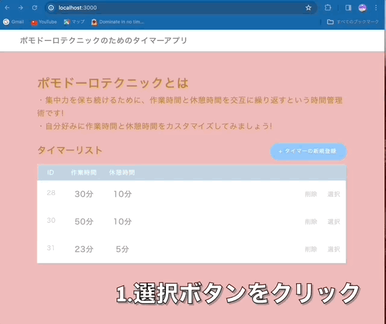
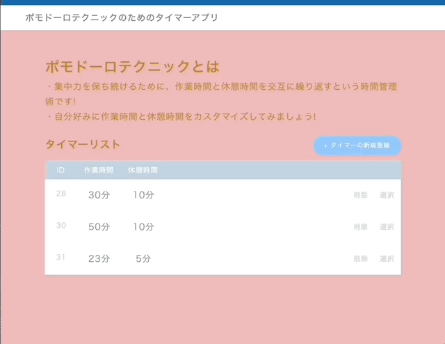

## アプリケーション名

ポモドーロテクニックのためのタイマーアプリ

## アプリケーション概要

作業時間と休憩時間を設定すると、交互に時間を計測してくれるアプリです。作業時間を 25 分, 休憩時間を 5 分程度にすると集中力をキープしやすいと言われています。集中力をキープし続けるための時間管理術を、ポモドーロテクニックと言います。自分好みの時間配分を、データベースへ登録し、いつでも使用できます。

### 利用方法

ローカル環境で、mysql と連携をすることで、データベースに保存できます。  
連携により、いつでもすぐにデータベースから好きな設定を選択可能です。

### 目指した課題解決

何回もタイマーをセットし直す手間を省くことができます。一度作業時間と休憩時間を入力すれば、ストップボタンを押すまで何度も繰り返してくれますので、集中力キープに打ってつけです。

### 機能

- データベースへ、自分好みのタイマーを新規登録
- データベースから、タイマーを削除
- データベースからタイマーを選択し、セット
- 作業時間、休憩時間のリセットやストップ

## 実際の使用例 1

1. タイマーを選択
2. サイクルスタート(作業時間 4 秒, 休憩時間 1 秒と時間を短くしています)
   

## 実際の使用例 2

1. タイマーの削除
2. タイマーの新規登録
3. 作成し、DB へ追加
4. 一覧画面へもどる

   

### データベースについて(例)

| id  | 作業時間(分) | 休憩時間 (分） |
| --- | ------------ | -------------- |
| 1   | 25           | 5              |
| 2   | 55           | 5              |
